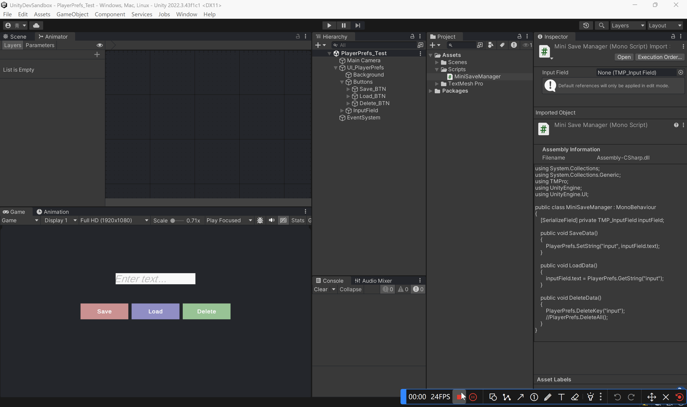

官方文档：[PlayerPrefs - Unity 脚本 API](https://docs.unity.cn/cn/2022.3/ScriptReference/PlayerPrefs.html)

视频教程：[Basic Saving and Loading in Unity with PlayerPrefs](https://www.youtube.com/watch?v=x-5lrUSBwXY)

# 1.简介

PlayerPrefs是一个用于存储玩家偏好设定（Player preference）的类，它可以存储三种类型的数据：string、float和integer。

存储的数据保存在用户的本地注册表中，它所存储的数据能够在不同的游戏会话之间加载。

注意：

- 不要用于存储敏感信息。
- 频繁保存会影响性能。

# 2.应用场景

- 音乐音量、分辨率、全屏等设置
- 排行
- 制作游戏原型时，暂时储存数据
# 3.常用API

| API                                                          |                                                             |
| ------------------------------------------------------------ | ----------------------------------------------------------- |
| [DeleteAll](https://docs.unity.cn/cn/2022.3/ScriptReference/PlayerPrefs.DeleteAll.html) | 从偏好设置中删除所有键和值。请谨慎使用。                    |
| [DeleteKey](https://docs.unity.cn/cn/2022.3/ScriptReference/PlayerPrefs.DeleteKey.html) | 从偏好设置中删除给定的键。如果键不存在，DeleteKey没有影响。 |
| [GetFloat](https://docs.unity.cn/cn/2022.3/ScriptReference/PlayerPrefs.GetFloat.html) | 返回偏好设置文件中与 key 对应的值（如果存在）。             |
| [GetInt](https://docs.unity.cn/cn/2022.3/ScriptReference/PlayerPrefs.GetInt.html) | 返回偏好设置文件中与 key 对应的值（如果存在）。             |
| [GetString](https://docs.unity.cn/cn/2022.3/ScriptReference/PlayerPrefs.GetString.html) | 返回偏好设置文件中与 key 对应的值（如果存在）。             |
| [HasKey](https://docs.unity.cn/cn/2022.3/ScriptReference/PlayerPrefs.HasKey.html) | 如果偏好中存在给定的键，返回ture，否则返回false。           |
| [Save](https://docs.unity.cn/cn/2022.3/ScriptReference/PlayerPrefs.Save.html) | 保存所有修改项。                                            |
| [SetFloat](https://docs.unity.cn/cn/2022.3/ScriptReference/PlayerPrefs.SetFloat.html) | 为给定的键设置浮点类型值。                                  |
| [SetInt](https://docs.unity.cn/cn/2022.3/ScriptReference/PlayerPrefs.SetInt.html) | 为给定的键设置整数类型值。                                  |
| [SetString](https://docs.unity.cn/cn/2022.3/ScriptReference/PlayerPrefs.SetString.html) | 为给定的键设置字符串类型值。                                |
# 4.例子

## 例子1：存储文字
这里实现一个较为简单的例子：



- 文本框用于输入文字
- 点击按钮，进行存储、加载或是删除

```cs
using TMPro;
using UnityEngine;

public class MiniSaveManager : MonoBehaviour
{
    [SerializeField] private TMP_InputField inputField;

    // 保存数据
    public void SaveData()
    {
        PlayerPrefs.SetString("input", inputField.text);
    }

    // 加载数据
    public void LoadData()
    {
        inputField.text = PlayerPrefs.GetString("input");
    }

    // 删除数据
    public void DeleteData()
    {
        PlayerPrefs.DeleteKey("input");
        //PlayerPrefs.DeleteAll(); 
    }
}
```